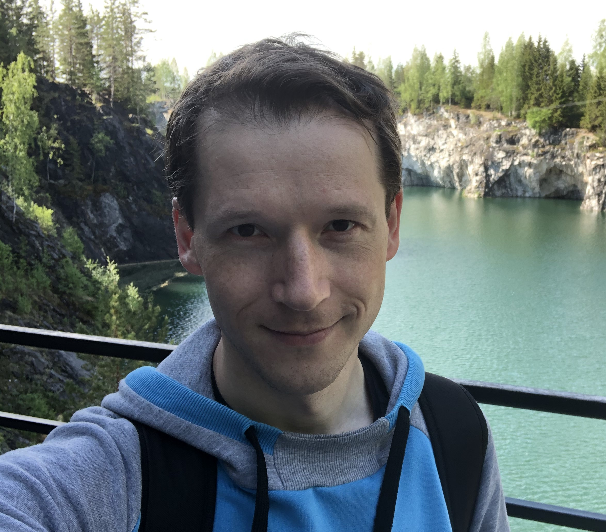

# Viktor Belov
## Contacts
**E-mail:** *vikwhitekbl@yandex.ru*   
**Githab:** *vikwhitekbl*
## Summary 
I am 38 years old, I live in Saint Petersburg. 2 years ago I decided to change job, for which I signed up and ended a QA course. After 3 months, I got a job as a QA, where I'm still working. My goal in this course is to learn how to work in javascript with the ability to automate tests.
## Skills 
I have basic skills in JS and Python.
## Code
Example of Codewars task:

```python
def multiply(a, b):
    return a * b
```

## Work experience
Junior QA - 1 year.
## Education
- Primary education - BSTU "Voenmeh", engineer
- Additional education - NTI Educational Competence Center, professional retraining under the program "Tester - a simple entry into the programmer profession"
- Additional education - RS School JS/FE PRE-SCHOOL

## English
B1 - Intermediate